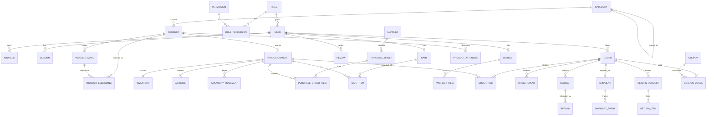

# ER diagram (core)

```mermaid
erDiagram
  ROLE ||--o{ USER : grants
  ROLE ||--o{ ROLE_PERMISSION : has
  PERMISSION ||--o{ ROLE_PERMISSION : in
  USER ||--o{ ADDRESS : owns
  USER ||--o{ SESSION : has
  USER ||--o| CART : has
  USER ||--o| WISHLIST : has
  USER ||--o{ ORDER : places
  USER ||--o{ REVIEW : writes
  CATEGORY ||--o{ CATEGORY : parent_of
  CATEGORY ||--o{ PRODUCT : contains
  PRODUCT ||--|{ PRODUCT_VARIANT : "sold as"
  PRODUCT ||--o{ PRODUCT_IMAGE : shows
  PRODUCT ||--o{ PRODUCT_ATTRIBUTE : describes
  PRODUCT ||--o{ PRODUCT_EMBEDDING : "indexed as"
  PRODUCT_IMAGE ||--o{ PRODUCT_EMBEDDING : "indexed as"
  PRODUCT_VARIANT ||--|| INVENTORY : stocks
  PRODUCT_VARIANT ||--|{ BARCODE : labelled
  PRODUCT_VARIANT ||--o{ INVENTORY_MOVEMENT : ledger
  SUPPLIER ||--o{ PURCHASE_ORDER : supplies
  PURCHASE_ORDER ||--|{ PURCHASE_ORDER_ITEM : lines
  PRODUCT_VARIANT ||--o{ PURCHASE_ORDER_ITEM : ordered
  CART ||--o{ CART_ITEM : holds
  PRODUCT_VARIANT ||--o{ CART_ITEM : in
  WISHLIST ||--o{ WISHLIST_ITEM : holds
  ORDER ||--|{ ORDER_ITEM : contains
  PRODUCT_VARIANT ||--o{ ORDER_ITEM : snapshot_of
  ORDER ||--o{ ORDER_EVENT : timeline
  ORDER ||--o{ PAYMENT : paid_by
  PAYMENT ||--o{ REFUND : refunded_by
  ORDER ||--o| SHIPMENT : shipped_as
  SHIPMENT ||--o{ SHIPMENT_EVENT : tracks
  ORDER ||--o{ RETURN_REQUEST : returns
  RETURN_REQUEST ||--|{ RETURN_ITEM : lines
  ORDER ||--o| COUPON_USAGE : used
  COUPON ||--o{ COUPON_USAGE : consumed
```
